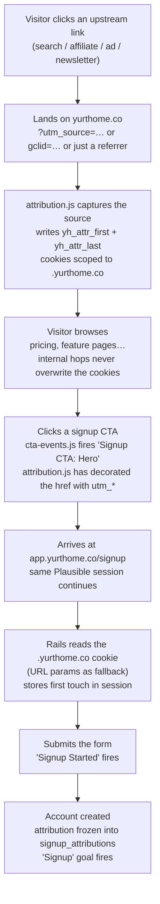

# Signup Attribution

How Yurt tracks a visitor from the moment they arrive from an upstream source
through to creating an account — across two separate codebases.

- **`yurthome.co`** — this repo. Static marketing site, built with webpack, served by GitHub Pages out of `docs/`.
- **`app.yurthome.co`** — the Rails application. A different repo, not covered by this build.

Because these are two applications on two hosts, attribution has to be
deliberately carried across the boundary. Nothing about it is automatic.

---

## The two systems, and why there are two

| | Plausible | Rails database |
|---|---|---|
| Answers | "Which channels drive signups?" | "Where did *this specific user* come from?" |
| Grain | Aggregate, session-scoped | Per-user, permanent |
| Attribution model | Last touch | First touch (last touch also stored) |
| Lifetime | Session (30 min inactivity) | Forever, joinable to revenue |
| Mechanism | Shared tracking script on both hosts | Cookie on `.yurthome.co` |

**These two will disagree, and neither is wrong.** Use Plausible for "which
channel is working this month." Use the database for "what is the lifetime value
of users from this affiliate." Do not try to reconcile the numbers.

---

## The journey



---

## Stage 1 — Arrival

### What is captured automatically

| Source | Mechanism | Notes |
|---|---|---|
| Organic search | `document.referrer` | Google/Bing/DDG send only the domain, e.g. `https://www.google.com/`. No keyword — use Search Console for that. |
| Referral sites | `document.referrer` | Browsers send the domain only, never the full path. |
| Google Ads | `gclid` param | Set by Google auto-tagging. Plausible detects it and attributes to Paid Search, but **strips the value** for GDPR reasons — you can filter by "came from Google Ads" but cannot join back to a specific click. |
| Microsoft Ads | `msclkid` param | Same treatment as `gclid`. |

### What is NOT automatic

**Search engines do not set UTM parameters.** Nothing does, except ad platforms
with auto-tagging. Any channel where you control the link — affiliates,
newsletters, sponsorships, your own social posts, forum comments — must be
tagged by hand or it will land in the bucket of whatever referrer the browser
happens to send.

### Tagging convention

Lowercase everything. Plausible treats `Reddit` and `reddit` as two different
values, and the capture code lowercases on the way in, so inconsistent tagging
just produces confusion when you go looking for it.

```
?utm_source=<specific place>    nerdwallet, reddit, homeowner-newsletter
&utm_medium=<channel type>      affiliate, email, social, cpc, referral
&utm_campaign=<initiative>      2026-q3-launch
&utm_content=<variant>          optional — for A/B distinctions
&utm_term=<keyword>             optional — paid search keywords
```

UTM tags take priority over `gclid`/`msclkid` when both are present.
Plausible also honours `ref` and `source` as shorthands for `utm_source`.

---

## Stage 2 — Capture on the marketing site

Implemented in **`src/js/attribution.js`**, initialised from both entry points
(`src/js/main.js` and `src/js/pricing.js` — `pricing.html` uses its own webpack
chunk, so it needs its own wiring).

### The key insight

`app.yurthome.co` is a **subdomain** of `yurthome.co`. A cookie scoped to
`.yurthome.co` is readable by both hosts. That is the whole mechanism — no
cross-domain linking machinery, no ID syncing, no redirect dance.

### Two cookies

| Cookie | Written when | Purpose |
|---|---|---|
| `yh_attr_first` | Only if absent | First touch. **Never overwritten.** The channel that originally discovered this person. |
| `yh_attr_last` | On any visit carrying real signal | Last touch. The channel that brought them back most recently. |

Both are scoped `domain=.yurthome.co`, `path=/`, `samesite=lax`, `secure`, with
a 90-day `max-age`.

"Real signal" means the visit carried a campaign param **or** an external
referrer. A direct visit with no referrer tells us nothing new, so it is not
allowed to overwrite an existing last-touch record — otherwise someone who
arrives via an affiliate link on Monday and types the URL directly on Tuesday
would have their attribution wiped.

### Cookie payload

JSON, URL-encoded:

```json
{
  "utm_source": "nerdwallet",
  "utm_medium": "affiliate",
  "utm_campaign": "2026-q3-launch",
  "gclid": "xyz",
  "referrer": "https://www.nerdwallet.com/article",
  "landing_page": "/pricing.html",
  "ts": "2026-07-25T14:03:11.000Z"
}
```

Captured keys: `utm_source`, `utm_medium`, `utm_campaign`, `utm_content`,
`utm_term`, `gclid`, `msclkid`, `ref`, `source`, plus `referrer`,
`landing_page`, `ts`.

### Self-referrals are ignored

When a visitor moves from `yurthome.co/` to `yurthome.co/pricing.html`, the
referrer is our own site. That is an internal hop, not an acquisition source,
and recording it would overwrite real attribution with noise. `attribution.js`
discards any referrer whose hostname is `yurthome.co` or a subdomain of it.

The Rails side must apply the same rule — `request.referer` on
`app.yurthome.co/signup` will be `https://yurthome.co/pricing.html`.

### Link decoration (the fallback path)

Every `<a>` pointing at `app.yurthome.co/signup` has the campaign params
appended to its `href` on page load. This is deliberate redundancy: it covers
visitors whose cookies are blocked or cleared, and it makes attribution visible
in Rails request logs.

Three rules the implementation follows:

1. **Signup links only.** Decorating a *login* link would make an existing
   user's return visit look like fresh campaign traffic, because Plausible reads
   UTM params off the URL on `app.yurthome.co` too. That would inflate exactly
   the campaign numbers this system exists to measure.
2. **Existing params are never clobbered** — `?plan=plus` on the pricing card
   CTA survives.
3. **Only campaign params are forwarded.** The referrer and landing page would
   bloat the URL; the cookie already carries them.

---

## Stage 3 — CTA clicks

Implemented in **`src/js/cta-events.js`**. One delegated click listener fires a
distinct Plausible event per CTA location.

Event names come from a `data-cta` attribute on the link or its nearest
ancestor — deliberately explicit rather than inferred from CSS class names.
Event names are a contract with the Plausible dashboard, and a redesign that
renamed a class would otherwise silently rename a goal and split its history.

| `data-cta` | Event fired | Where |
|---|---|---|
| `nav` | `Signup CTA: Nav` | Header, all pages |
| `hero` | `Signup CTA: Hero` | Hero section |
| `banner` | `Signup CTA: Banner` | Mid/bottom-page CTA banner |
| `footer` | `Signup CTA: Footer` | Footer "Account" column |
| `pricing-basic` | `Signup CTA: Pricing Basic` | Pricing page, Basic card |
| `pricing-plus` | `Signup CTA: Pricing Plus` | Pricing page, Plus card |
| *(none)* | `Signup CTA: Other` | Tripwire — a new CTA added without a marker |

### Login clicks are deliberately not tracked

Existing users' acquisition source was already recorded when they first signed
up, so there is nothing to learn. More concretely: **Plausible bills on
pageviews *plus* custom events**, so ingesting login clicks costs quota for data
nobody will read. Login links are excluded from both event firing and URL
decoration.

### Adding a new CTA

Add `data-cta="…"` to the link or its container, add the value to
`CTA_LOCATIONS` in `cta-events.js`, and **create the matching goal in Plausible
before deploying**. If you forget the marker, the click still counts as
`Signup CTA: Other` rather than vanishing.

---

## Stage 4 — Crossing to the Rails app

Two things must be true, or the whole chain breaks silently.

**1. `app.yurthome.co` is on the same Plausible site as `yurthome.co`.**
Add it to the allowed hostnames in Site Settings. Both hosts must resolve to the
*same* Plausible site key. Since both now load the tracker through the
first-party proxy, `PLAUSIBLE_ANALYTICS_KEY` in the Rails environment is the
single place that key is defined — see *The first-party analytics proxy* below.
Plausible preserves sessions and referral source across subdomains, so the
original source survives the hop and the signup conversion is attributed to it
automatically.

If instead you see the signup attributed to `yurthome.co` as a *referral*, the
two hosts are not sharing a site and everything downstream is wrong.

**2. Plausible counts a referrer only when it starts a new session,** which is
why the `yurthome.co → app.yurthome.co` hop does not reset the source.

---

## Stage 5 — Rails: capture and persist

> **Not yet implemented.** This section is the specification for the Rails side.

### Read attribution on every request

First touch wins — once the session holds attribution, it is never replaced.
The cookie is preferred over URL params; params are the fallback for when the
cookie is missing.

```ruby
# app/controllers/concerns/attribution_tracking.rb
module AttributionTracking
  extend ActiveSupport::Concern

  CAMPAIGN_PARAMS = %w[
    utm_source utm_medium utm_campaign utm_content utm_term
    gclid msclkid ref source
  ].freeze

  STORED_KEYS = (CAMPAIGN_PARAMS + %w[referrer landing_page]).freeze

  included do
    before_action :capture_attribution
  end

  private

  def capture_attribution
    return if session[:attribution].present? # first touch wins

    attrs = attribution_from_cookie || attribution_from_params
    return if attrs.blank?

    attrs['landing_page'] ||= request.path
    attrs['referrer']     ||= external_referrer
    attrs['first_seen_at'] = Time.current.iso8601

    session[:attribution] = attrs
  end

  # The .yurthome.co cookie set by the marketing site. Prefer last touch.
  def attribution_from_cookie
    raw = cookies['yh_attr_last'].presence || cookies['yh_attr_first'].presence
    return if raw.blank?

    JSON.parse(raw).slice(*STORED_KEYS).compact_blank.presence
  rescue JSON::ParserError
    nil
  end

  # Fallback: params from the decorated link.
  def attribution_from_params
    params.to_unsafe_h.slice(*CAMPAIGN_PARAMS).compact_blank.presence
  end

  # Same self-referral rule as the marketing site.
  def external_referrer
    host = URI.parse(request.referer.to_s).host
    return if host.blank? || host.end_with?('yurthome.co')

    request.referer.truncate(500)
  rescue URI::InvalidURIError
    nil
  end
end
```

Include it in `ApplicationController`.

### Freeze it onto the user at signup

```ruby
# db/migrate/..._create_signup_attributions.rb
create_table :signup_attributions do |t|
  t.references :user, null: false, foreign_key: true, index: { unique: true }
  t.string :utm_source, :utm_medium, :utm_campaign, :utm_content, :utm_term
  t.string :gclid, :msclkid, :ref, :source
  t.string :referrer, :landing_page
  t.datetime :first_seen_at
  t.timestamps
end
add_index :signup_attributions, %i[utm_source utm_medium]
```

### Fire the Signup goal

**Not on a button click.** A click on "Create account" is an *attempt* —
validation failures and abandoned retries would all count as conversions. Fire
it from the server, after `save` actually succeeds.

The successful path ends in a redirect, so carry the intent across it in the
flash:

```ruby
# app/controllers/registrations_controller.rb
def create
  @user = User.new(user_params)

  if @user.save
    @user.create_signup_attribution!(session[:attribution] || {})
    session.delete(:attribution)
    sign_in(@user)

    flash[:plausible_event] = 'Signup'
    redirect_to welcome_path
  else
    render :new, status: :unprocessable_entity
  end
end
```

```erb
<%# app/views/layouts/application.html.erb %>
<head>
  <%# Proxied through our own domain so ad blockers don't drop it %>
  <script async src="<%= analytics_script_path %>"></script>
  <script>
    ((window.plausible = window.plausible || function () {
      (plausible.q = plausible.q || []).push(arguments);
    }),
      (plausible.init = plausible.init || function (i) { plausible.o = i || {}; }));
    plausible.init({ endpoint: '<%= analytics_event_path %>' });
  </script>
</head>
<body>
  <% if flash[:plausible_event].present? %>
    <div id="plausible-event" data-event="<%= flash[:plausible_event] %>" hidden></div>
  <% end %>
```

```js
// app/javascript/plausible_events.js
const fireQueuedEvent = () => {
  const el = document.getElementById('plausible-event');
  if (!el || typeof window.plausible !== 'function') return;

  window.plausible(el.dataset.event);
  el.remove(); // fire once, even if Turbo restores this page from cache
};

document.addEventListener('turbo:load', fireQueuedEvent);
document.addEventListener('DOMContentLoaded', fireQueuedEvent);

// Click-driven events — the correct use of a click interceptor
document.addEventListener('click', (e) => {
  const el = e.target.closest('[data-plausible-event]');
  if (!el || typeof window.plausible !== 'function') return;

  window.plausible(el.dataset.plausibleEvent);
});
```

A data attribute rather than an inline `<script>` because it survives Turbo
navigations and does not break under a CSP with nonces. The flash is consumed on
render, so a refresh will not re-fire.

`Signup Started` belongs on the submit button, where a click genuinely is the
thing being measured:

```erb
<%= f.submit "Create account", data: { plausible_event: "Signup Started" } %>
```

`Signup Started` minus `Signup` is your form abandonment rate.

### Server-side fallback (only if signup is confirmation-gated)

If the real conversion happens when someone clicks an email confirmation link,
there may be no usable browser session. Use the Events API from a background
job:

```ruby
class PlausibleEvent
  ENDPOINT = URI('https://plausible.io/api/event').freeze
  DOMAIN = 'yurthome.co'.freeze # the Plausible SITE domain, not app.yurthome.co

  def self.track(name:, url:, user_agent:, ip:, props: {})
    Net::HTTP.post(
      ENDPOINT,
      { domain: DOMAIN, name: name, url: url, props: props }.to_json,
      'Content-Type' => 'application/json',
      'User-Agent' => user_agent.to_s,
      'X-Forwarded-For' => ip.to_s
    )
  end
end
```

- `domain` is `yurthome.co` — you are sending to the shared site.
- Forward the **real visitor's** UA and IP. Sending your server's IP gets the
  event silently dropped by bot filtering. Debug with `X-Debug-Request: true`
  and check the response for `x-plausible-dropped: 1`.
- **Do not fire both client-side and server-side** — you will double count.
- Server-side attribution is weaker, since Plausible reconstructs the session
  from UA + IP. Prefer the client-side flash pattern whenever the signup
  finishes in a browser.

---

## The first-party analytics proxy

> **Implemented** in the Rails repo — `AnalyticsController` and
> `Analytics::PlausibleClient`.

Ad blockers match on the `plausible.io` domain, so requests to it never leave
the browser — losing the tracker script *and* every event. The Rails app
re-serves both halves from our own domain.

| Route | Action | Serves |
|---|---|---|
| `GET /pa.js` | `analytics#script` | The tracker, fetched server-side from `https://plausible.io/js/$PLAUSIBLE_ANALYTICS_KEY.js`, memoized 5 minutes, browser-cached 1 day |
| `POST /pa/e` | `analytics#event` | Relays the raw event body to `https://plausible.io/api/event` |

**Both halves must be proxied.** Blocking the event endpoint alone is enough to
lose the pageview, so proxying only the script buys nothing.

### How each host loads it

**Rails app** — relative paths, since the proxy is on the same host:

```erb
<script async src="<%= analytics_script_path %>"></script>
<script>
  window.plausible=window.plausible||function(){(plausible.q=plausible.q||[]).push(arguments)},plausible.init=plausible.init||function(i){plausible.o=i||{}};
  plausible.init({ endpoint: '<%= analytics_event_path %>' })
</script>
```

**Marketing site** (`src/*.html`, inside the `isProd` block) — absolute URLs,
since this is a different host:

```html
<script async src="https://app.yurthome.co/pa.js"></script>
<script>
  /* …the standard Plausible queue stub… */
  plausible.init({ endpoint: 'https://app.yurthome.co/pa/e' });
</script>
```

Cross-origin is fine, and is Plausible's own documented setup — their Cloudflare
Worker guide points `endpoint` at a `*.workers.dev` host. The tracker posts with
`Content-Type: text/plain`, which is CORS-safelisted, so this is a *simple
request*: no preflight, and the browser sends it even though it will not let JS
read the response. No `Access-Control-Allow-Origin` header is needed.

### What the proxy couples together

Three consequences worth holding in mind, because each fails silently.

- **`PLAUSIBLE_ANALYTICS_KEY` is now the single definition of site identity.**
  This site no longer hardcodes `pa-9F7dEWKoi0O8BsMWsl3Kr.js`; it gets whatever
  that env var points at. If the value drifts, the two hosts land in *different*
  Plausible sites, sessions stop being shared, and every signup is attributed to
  `yurthome.co` as a referral instead of to its real source.
- **Marketing-site analytics now depend on `app.yurthome.co` being up.**
  `AnalyticsController` degrades gracefully when *Plausible* is down — it serves
  an empty, deliberately uncached script — but nothing degrades gracefully when
  *Rails* is down. A Rails outage takes analytics down on the static site too.
- **`X-Forwarded-For` must carry the real visitor IP.** `PlausibleClient.track`
  forwards `request.remote_ip`. If that ever resolves to the server's own IP,
  Plausible's bot filter drops every event silently. The controller surfaces
  Plausible's `x-plausible-dropped` signal as a response header for debugging.

---

## Plausible configuration

### Events vs. goals

An **event** is what the script sends. A **goal** is a dashboard-side definition
that surfaces that event in the Goal Conversions report. Sending an event is not
enough.

- Goal names must match event names **character for character, including
  capitalisation** — `Signup CTA: Hero`, with a colon and a space.
- **There is no backfill.** A goal created after events started flowing counts
  from zero at the moment of creation. **Create every goal before deploying.**
- No wildcards for custom event goals. Each is an exact string.
- Custom events count toward your billing quota. Pageview goals do not.

### Goals to create

**On the marketing site (this repo, implemented):**

- `Signup CTA: Nav`
- `Signup CTA: Hero`
- `Signup CTA: Banner`
- `Signup CTA: Footer`
- `Signup CTA: Pricing Basic`
- `Signup CTA: Pricing Plus`
- `Signup CTA: Other`

**In the Rails app (not yet implemented):**

- `Signup Started`
- `Signup` ← the one that matters

### The funnel

```
Pageview on yurthome.co                    automatic
  → Signup CTA: Hero                       which button is working
    → Pageview on app.yurthome.co/signup   automatic
      → Signup Started                     reached the form and tried
        → Signup                           account created
```

`Signup` carries the attribution payoff: because it fires inside the same
Plausible session, you get "signups by `utm_source`" with none of the cookie
plumbing. The CTA goals tell you *which button* works; `Signup` tells you *which
channel* works.

Custom properties and the visual Funnels report are **Business plan** features.
The CTA location is baked into the event name precisely so this works on any
plan — props are sent too, and are simply ignored on lower tiers.

---

## Known limitations

Accept these deliberately rather than discovering them later.

- **Cookie consent.** Plausible itself is cookieless. The `yh_attr_*` cookies
  are ours, are first-party analytics cookies, and likely require consent under
  GDPR/ePrivacy for EU visitors. If that is unacceptable, drop the cookies and
  rely on link decoration alone — you lose attribution for anyone who reaches
  the app by typing the URL.
- **Safari ITP caps JS-set cookies at 7 days.** The 90-day first-touch window is
  really 7 days on Safari. The usual fix is setting the cookie server-side, but
  `yurthome.co` is static on GitHub Pages with no server. Effect: first-touch
  under-reports long consideration cycles on Safari.
- **Some CTA clicks are lost to the navigation race.** The event fires on
  `click` and the browser may unload before the request lands. CTA counts are a
  slight undercount — read them comparatively, not as absolutes.
- **`gclid`/`msclkid` values are stripped by Plausible**, so you cannot join a
  Plausible conversion back to a specific ad click. The raw value *is* stored in
  our own cookie and database, so the Rails side can still do that join.
- **Plausible sessions expire after 30 minutes of inactivity.** A visitor who
  browses, walks away for an hour, then signs up will start a new Plausible
  session and lose the source there. The cookie is unaffected, which is the main
  argument for keeping the database as the source of truth.
- **Different domains do not share sessions.** This works only because
  `app.yurthome.co` is a subdomain. A genuinely separate domain would need a
  different approach.
- **The analytics proxy makes this site depend on the Rails app.** Both the
  tracker and every event are served through `app.yurthome.co`. If Rails is
  down, the marketing site has no analytics — see *The first-party analytics
  proxy* above.

---

## Verifying it works

End-to-end smoke test after any change:

1. Clear cookies for `yurthome.co`.
2. Visit `https://yurthome.co/?utm_source=test&utm_medium=manual`. In the Network
   tab, confirm `pa.js` loads from `app.yurthome.co` with a 200 and a non-empty
   body, and that the pageview POSTs to `app.yurthome.co/pa/e` — not to
   `plausible.io`. An empty `pa.js` body means `PLAUSIBLE_ANALYTICS_KEY` is
   unset or Plausible could not be reached.
3. DevTools → Application → Cookies: confirm `yh_attr_first` and `yh_attr_last`
   exist on `.yurthome.co` and contain `utm_source: "test"`.
4. Navigate to `/pricing.html`. Confirm the cookies were **not** overwritten by
   the internal hop.
5. Inspect a signup CTA's `href` — it should carry `?utm_source=test&utm_medium=manual`.
   Inspect a login link — it should carry **nothing**.
6. Click through and create an account.
7. In Plausible, confirm the `Signup` conversion is attributed to source `test`
   — **not** to `yurthome.co` as a referral. A referral attribution means the two
   hosts are not sharing a Plausible site.
8. In the Rails console, confirm the new user's `signup_attribution` row.

The marketing-site logic has unit coverage driven through a stubbed DOM
(campaign capture, lowercasing, self-referrer rejection, first-touch
immutability, `?plan=plus` preservation, cookie flags, localhost degradation,
and CTA event naming).

---

## File map

| File | Role |
|---|---|
| `src/js/attribution.js` | Capture source, write cookies, decorate signup links |
| `src/js/cta-events.js` | Fire named Plausible events on signup CTA clicks |
| `src/js/main.js` | Entry point — initialises both (all pages except pricing) |
| `src/js/pricing.js` | Entry point — initialises both (pricing page, own chunk) |
| `src/*.html` | `data-cta` markers, plus the Plausible snippet pointing at the proxy (inside the `isProd` block) |
| `docs/` | **Build output.** Never edit directly — `yarn build` wipes it. |

Rails-side files live in the app repo. Already built: `analytics_controller.rb`
and `services/analytics/plausible_client.rb` (the proxy). Still specified but
unbuilt: `attribution_tracking.rb`, the `signup_attributions` migration, and
`plausible_events.js`.
