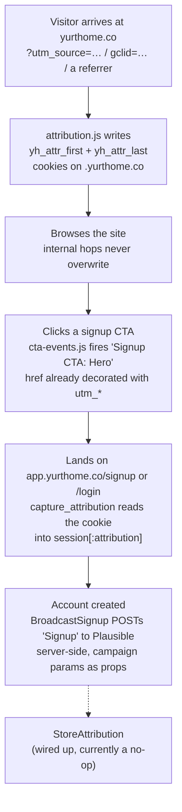

# Signup Attribution

How Yurt tracks a visitor from an upstream source through to account creation,
across two codebases:

- **`yurthome.co`** — this repo. Static site, webpack, GitHub Pages out of `docs/`.
- **`app.yurthome.co`** — the Rails app. Separate repo (`../yurt`).

Two hosts means attribution has to be carried across the boundary deliberately.
Nothing about it is automatic.

---

## The two systems

| | Plausible | Rails database |
|---|---|---|
| Answers | "Which channels drive signups?" | "Where did *this* user come from?" |
| Grain | Aggregate, session-scoped | Per-user, permanent |
| Model | Last touch | First touch (last touch also stored) |
| Mechanism | Shared Plausible site across both hosts | `.yurthome.co` cookie |
| Status | **Built** | **Not built** — see *Status* below |

They will disagree, and neither is wrong. Plausible answers "which channel is
working this month"; the database answers "what are affiliate users worth."
Don't try to reconcile the numbers.

---

## The flow



---

## Marketing site (this repo)

| File | Role |
|---|---|
| `src/js/attribution.js` | Capture source, write cookies, decorate signup links |
| `src/js/cta-events.js` | Fire named Plausible events on signup CTA clicks |
| `src/js/main.js`, `src/js/pricing.js` | Both entry points initialise both modules |
| `src/*.html` | `data-cta` markers + the Plausible snippet (inside `isProd`) |

**Cookies.** Both scoped `domain=.yurthome.co`, `path=/`, `samesite=lax`,
`secure`, 90-day max-age. `app.yurthome.co` is a subdomain, so it reads the same
cookie — that is the entire cross-host mechanism. No ID syncing, no redirects.

- `yh_attr_first` — written only if absent. **Never overwritten.**
- `yh_attr_last` — rewritten on any visit carrying *real signal*: a campaign
  param or an **external** referrer. Direct visits and internal hops don't
  overwrite it, so an affiliate click on Monday survives a direct visit Tuesday.

Payload is URL-encoded JSON: the campaign params present, plus `referrer`,
`landing_page`, `ts`. Captured params are `utm_source`, `utm_medium`,
`utm_campaign`, `utm_content`, `utm_term`, `gclid`, `msclkid`, `ref`, `source` —
lowercased and truncated on the way in.

On localhost the `domain` attribute is dropped (a `.yurthome.co` cookie would be
rejected); the cookie is still written, unscoped.

**Link decoration.** Every `<a>` into `app.yurthome.co/signup` gets the campaign
params appended to its `href` — redundancy for blocked cookies. Existing params
(`?plan=plus`) are never clobbered. Only campaign params are forwarded; the
cookie already carries the rest.

**CTA events.** One delegated click listener. The location comes from `data-cta`
on the link or nearest ancestor:

`nav` · `hero` · `banner` · `footer` · `pricing-basic` · `pricing-plus` →
`Signup CTA: Nav`, `Signup CTA: Hero`, … and `Signup CTA: Other` as a tripwire
for an unmarked CTA.

`data-cta` is explicit rather than inferred from CSS classes because event names
are a contract with the dashboard — a redesign must not silently rename a goal.

---

## Rails app (`../yurt`)

Implemented in commit `50f7a3d5`.

| File | Role |
|---|---|
| `app/controllers/concerns/capture_attribution.rb` | Read cookie/params into `session[:attribution]` |
| `app/services/analytics/broadcast_signup.rb` | POST the `Signup` event to Plausible, server-side |
| `app/services/analytics/store_attribution.rb` | Persist onto the user — **no-op, not built** |
| `app/services/analytics/plausible_client.rb` | The proxy client (script fetch + event relay) |
| `app/controllers/analytics_controller.rb` | `GET /pa.js`, `POST /pa/e` |

**Capture runs on two pages only** — `sessions#new` (`/login`) and
`registrations#new` (`/signup`), via `before_action :capture_attribution`. It is
*not* a global before_action, so a visitor who lands anywhere else in the app
first is not captured. Within the session, first touch wins: once
`session[:attribution]` is set it is never replaced. The cookie is preferred
over URL params, and `yh_attr_last` is preferred over `yh_attr_first`.

Self-referrals are suppressed here too, since `request.referer` on
`/signup` is legitimately `https://yurthome.co/...`. The check uses
`ENV['DOMAIN']`, not a hardcoded host.

**The `Signup` event is fired server-side**, from `BroadcastSignup`, after the
user is actually created — called from `registrations#create` and from
`omniauth_callbacks#google_oauth2` (new users only). It sends the campaign
params as **custom props**, with `domain: ENV['DOMAIN']`, and is gated on
`PLAUSIBLE_ANALYTICS_KEY` being present.

A click on "Create account" is only an *attempt*, which is why this is not
client-side: validation failures and retries would each count as a conversion.

**The tracker only loads on unauthenticated pages** (`!user_signed_in?` in the
layout). Pageviews inside the signed-in app are deliberately not tracked.

---

## The first-party analytics proxy

Ad blockers match on the `plausible.io` domain, so requests to it never leave the
browser — losing the tracker *and* every event. Rails re-serves both halves from
our own domain. **Both halves must be proxied**; blocking the event endpoint
alone is enough to lose the pageview.

| Route | Serves |
|---|---|
| `GET /pa.js` | Tracker fetched from `plausible.io/js/$PLAUSIBLE_ANALYTICS_KEY.js`, memoized 5 min, browser-cached 1 day. Falls back to an empty, uncached script if Plausible is down. |
| `POST /pa/e` | Relays the raw body to `plausible.io/api/event`, capped at 2 KB. Surfaces Plausible's `x-plausible-dropped` as a response header. |

This site loads it with absolute URLs (`https://app.yurthome.co/pa.js`, and
`plausible.init({ endpoint: 'https://app.yurthome.co/pa/e' })`) since it's a
different host. Cross-origin is fine: the tracker posts `text/plain`, which is
CORS-safelisted, so it's a simple request with no preflight and no CORS headers
needed.

---

## Status

**Built:** everything on the marketing site; the proxy; Rails-side capture; the
server-side `Signup` event, including the Google OAuth signup path.

**Not built:**

- **`signup_attributions` — the whole per-user database half.** There is no
  model or table; `StoreAttribution` is deliberately an empty `call` already
  wired into both signup paths, so building it is a change to that class alone.
  It must not delete `session[:attribution]` before `BroadcastSignup` runs.
- **`Signup Started`.** No submit-button event exists, so there is no form
  abandonment number today.

---

## Invariants — breaking these corrupts the data

1. **Signup links only.** Login links get neither decoration nor CTA events.
   Decorating a login link makes a returning user look like fresh campaign
   traffic, inflating the exact numbers this system measures.
2. **First touch is immutable.** `yh_attr_first` is written once, ever.
3. **Self-referrals are never recorded** — on both sides.
4. **Adding a CTA** means adding `data-cta`, adding the value to `CTA_LOCATIONS`,
   *and* creating the matching goal in Plausible **before** deploying. Goal names
   must match event names character for character, and Plausible does not
   backfill — a goal created late counts from zero.
5. **Both entry points.** New analytics wiring goes in `main.js` *and*
   `pricing.js`.
6. **`PLAUSIBLE_ANALYTICS_KEY` is the single definition of site identity.** This
   site no longer hardcodes a key; it gets whatever the Rails env var points at.
   If it drifts, the hosts land in different Plausible sites, sessions stop being
   shared, and every signup is attributed to `yurthome.co` as a referral.
7. **`ENV['DOMAIN']` does double duty** — self-referral suppression *and* the
   Plausible site domain on server-side events. In production it must be
   `yurthome.co` (the Plausible site), not `app.yurthome.co`.

---

## Goals in Plausible

Marketing site: `Signup CTA: Nav` · `Hero` · `Banner` · `Footer` ·
`Pricing Basic` · `Pricing Plus` · `Other` (each prefixed `Signup CTA: `).
Rails: `Signup`.

```
Pageview on yurthome.co                    automatic
  → Signup CTA: Hero                       which button works
    → Pageview on app.yurthome.co/signup   automatic
      → Signup                             account created (server-side)
```

`Signup` carries the payoff: campaign params ride along as custom props, and
because both hosts share a Plausible site the session's original source survives
the hop. Custom properties and the Funnels report are Business-plan features —
the CTA location is baked into the event *name* precisely so the funnel works on
any plan.

---

## Known limitations

- **Cookie consent.** Plausible is cookieless, but `yh_attr_*` are ours and
  likely need consent under GDPR/ePrivacy for EU visitors. Dropping them means
  relying on link decoration alone, losing anyone who types the URL.
- **Safari ITP caps JS-set cookies at 7 days**, so the 90-day first-touch window
  is really 7 days there. The usual fix is a server-set cookie, impossible on a
  static GitHub Pages host.
- **Some CTA clicks are lost** to the navigation race — the page can unload
  before the event lands. Read CTA counts comparatively, not absolutely.
- **`gclid`/`msclkid` values are stripped by Plausible**, so a conversion can't
  be joined back to a specific ad click. The raw value *is* in our cookie, so the
  database half could do it once built.
- **Plausible sessions expire after 30 minutes.** Browse, walk away, come back
  and sign up, and the source is lost there. The cookie is unaffected — the main
  argument for building the database half.
- **Subdomains only.** Session sharing works because `app.yurthome.co` is a
  subdomain. A genuinely separate domain would need a different approach.
- **This site's analytics depend on the Rails app.** Both the tracker and every
  event route through `app.yurthome.co`. A Rails outage takes analytics down
  here too.
- **Attribution is only captured on `/login` and `/signup`.** Any other entry
  into the app misses it.

---

## Verifying it works

1. Clear cookies for `yurthome.co`.
2. Visit `https://yurthome.co/?utm_source=test&utm_medium=manual`. In the Network
   tab, confirm `pa.js` loads from `app.yurthome.co` with a 200 and a **non-empty**
   body, and that the pageview POSTs to `app.yurthome.co/pa/e`, not `plausible.io`.
   An empty `pa.js` means `PLAUSIBLE_ANALYTICS_KEY` is unset or unreachable.
3. Application → Cookies: `yh_attr_first` and `yh_attr_last` exist on
   `.yurthome.co` and contain `utm_source: "test"`.
4. Navigate to `/pricing.html` — confirm the internal hop did **not** overwrite them.
5. Inspect a signup CTA's `href`: carries the params. Inspect a login link:
   carries nothing.
6. Create an account.
7. In Plausible, confirm `Signup` is attributed to source `test` — **not** to
   `yurthome.co` as a referral. A referral attribution means the two hosts aren't
   sharing a site.

This repo has **no test suite**; the flow is covered on the Rails side by
`spec/features/auth/attribution_spec.rb` (cookie, first-touch-only, malformed
JSON, param fallback, no-attribution, Google OAuth, and the key-unset case) plus
service specs for `BroadcastSignup` and `StoreAttribution`.
